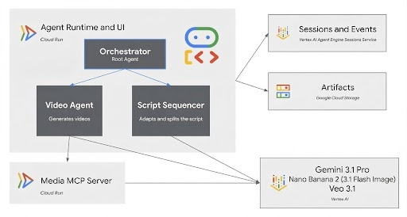

# Multi-Agent Team for Creating Long-form Videos

This repository demonstrates how to build a long-form video generation agent using the [Google Agent Development Kit (ADK)](https://google.github.io/adk-docs/), [Gemini 3.1 Flash Image(Nano Banana2)](https://docs.cloud.google.com/vertex-ai/generative-ai/docs/models/gemini/3-1-flash-image), and [Veo 3.1](https://console.cloud.google.com/vertex-ai/publishers/google/model-garden/veo-3.1-generate-preview?utm_campaign=CDR_0xc245fc42_default_b456742732&utm_medium=external&utm_source=event).

The purpose of the agent is to generate long-form videos with
custom avatars delivering educational content.

It demonstrates character and environment consistency techniques
that allow producing long videos as a series of 8-second chunks.

It also shows how to perform conversion of technical documentation
to video scripts that sound natural and engaging.

We provide demo assets in the [assets](assets) sub-folder:

* **4 images** to use as starting frames.
* **Full [prompt](assets/prompt.md)** with the following sections:
    1. Character Description
    2. Voice Description.
    3. Visual Appearance.
    4. Video Shot Instructions.
    5. Document to adapt and split across video chunks.


* 📄 Original documentation to deliver as a training video: [Safety and Security for AI Agents](https://google.github.io/adk-docs/safety/).
* 🎬 **[Final demo video](videos/anya-capy-final.mp4)**.

## Features

* Original text content conversion for making it sound natural
* Continuous video generation with character and scene consistency

## Architecture

It is a full-stack web application designed to be deployed on [Google Cloud Run](https://cloud.google.com/run/docs/overview/what-is-cloud-run?utm_campaign=CDR_0xc245fc42_default_b456742732&utm_medium=external&utm_source=event), with ADK Web UI,
using [Vertex AI Agent Engine Sessions Service](https://cloud.google.com/vertex-ai/generative-ai/docs/agent-engine/sessions/overview?utm_campaign=CDR_0xc245fc42_default_b456742732&utm_medium=external&utm_source=event) for session management and [Google Cloud Storage](https://cloud.google.com/storage/docs/introduction?utm_campaign=CDR_0xc245fc42_default_b456742732&utm_medium=external&utm_source=event) for storing artifacts.



### Agents

* **Orchestrator** (root agent) - The main agent that orchestrates the video generation process. It takes user input and calls sub-agents to perform specific tasks.
* **Script Sequencer** - Adapts the content into a script that sounds natural when delivered by a speaker. Splits script into chunks up to 8 seconds long.
* **Video Agent** - facilitates video generation according to instructions and input provided by the Orchestrator.

### MCP Server

`MediaGenerators` MCP Server with 2 tools:

1. `generate_video` - uses [Veo 3.1](https://console.cloud.google.com/vertex-ai/publishers/google/model-garden/veo-3.1-generate-preview?utm_campaign=CDR_0xc245fc42_default_b456742732&utm_medium=external&utm_source=event) model to generate videos. It can use start and frame in addition to the text prompt.
2. `generate_image` - uses [Gemini 3.1 Flash Image](https://docs.cloud.google.com/vertex-ai/generative-ai/docs/models/gemini/3-1-flash-image) (Nano Banana 2 🍌) to generate images.
Model ID=gemini-3.1-flash-image-preview
   It can use source image as a reference. This tool is not used by the repo's agent.

## Prerequisites

* An existing [Google Cloud Project](https://console.cloud.google.com/?utm_campaign=CDR_0xc245fc42_default_b456742732&utm_medium=external&utm_source=event). New customers [**get $300 in free credits**](https://cloud.google.com/free?utm_campaign=CDR_0xc245fc42_default_b456742732&utm_medium=external&utm_source=event) to run, test, and deploy workloads.
* [Google Cloud SDK](https://cloud.google.com/sdk/docs/install?utm_campaign=CDR_0xc245fc42_default_b456742732&utm_medium=external&utm_source=event).
* [Python 3.11+](https://www.python.org/downloads/?utm_campaign=CDR_0xc245fc42_default_b456742732&utm_medium=external&utm_source=event).

## Installation

1. Clone the repository:

    ```bash
    git clone https://github.com/vladkol/video-avatars-agent
    cd video-avatars-agent
    ```

2. Create a Python virtual environment and activate it:

    > We recommend using [`uv`](https://docs.astral.sh/uv/getting-started/installation/)

    ```bash
    uv venv .venv
    source .venv/bin/activate
    ```

3. Install the Python dependencies:

    ```bash
    uv pip install pip
    uv pip install -r agents/video_avatar_agent/requirements.txt
    uv pip install -r mcp/requirements.txt
    ```

## Configuration

1. Create a `.env` file in the root of the project by copying the `.env-template` file:

    ```bash
    cp .env-template .env
    ```

2. Update the `.env` file with your Google Cloud project ID, location, and the name of your GCS bucket for AI assets.

## Running Locally

### Windows PowerShell (recommended on Windows)

To start the MCP server run:

```powershell
.\deployment\run_mcp_local.ps1
```

To run the agent locally, use:

```powershell
.\deployment\run_agent_local.ps1
```

### Bash (Linux/macOS or Git Bash)

To start the MCP server run:

```bash
./deployment/run_mcp_local.sh
```

The MCP server will run on `http://localhost:8080`.

To run the agent locally, use the `run_agent_local.sh` script:

```bash
./deployment/run_agent_local.sh
```

This will:

1. Register an Agent Engine resource for using with the session service.
2. Start a local a web server with the ADK Web UI, which you can access in your browser.

## Deployment

To deploy the MCP server and the agent to Cloud Run, use the `deploy.sh` script:

```bash
./deployment/deploy.sh
```

This script will:

1. Register an Agent Engine resource for using with the session service.
2. Deploy the MCP server to Cloud Run.
3. Deploy the agent to Cloud Run, with the ADK Web UI.

## How to use the agent

1. Open the agent's ADK Web UI.
2. Insert content of [assets/prompt.md](assets/prompt.md) file to the chat box.
3. Click on the paperclip button 📎, and attach 4 source strip files:

    * [assets/view1.jpeg](assets/view1.jpeg)
    * [assets/view2.jpeg](assets/view3.jpeg)
    * [assets/view3.jpeg](assets/view3.jpeg)
    * [assets/view4.jpeg](assets/view4.jpeg)

    > **Note:** It is important to select `view1.jpeg` file first.
    > The first view is what the video starts with.

4. Hit **Enter** key to submit the request.
   The agent will start converting the script and generating videos.

### Persistent Character Profiles

You can reuse a stored character profile by including a line in your prompt:

```text
CHARACTER_PROFILE_ID: dr_anya_capy_v1
```

The root agent loads canonical character views from GCS, selects the exact view
assigned to each script chunk (`view_index` from the script sequencer), and
injects it as the starting frame for that video chunk — keeping identity stable
across all generated segments.

#### Step 1 — Generate canonical views and bootstrap the profile

Run the bootstrap script once. It generates 4 reference images for the character
using the Gemini image model, uploads them to GCS, and saves the profile:

```bash
# Preview prompts only (no API calls)
python deployment/bootstrap_character_views.py --dry-run

# Generate images, upload, and save profile to GCS
python deployment/bootstrap_character_views.py
# or with a custom profile file:
python deployment/bootstrap_character_views.py --profile-file assets/characters/example_profile.json
```

Outputs:

```text
PROFILE_ID=dr_anya_capy_v1
PROFILE_URI=gs://<bucket>/character-profiles/dr_anya_capy_v1/profile.json
```

#### Step 2 — Use the profile in the agent

In the ADK web UI or API, start your prompt with the profile ID line:

```text
CHARACTER_PROFILE_ID: dr_anya_capy_v1

<your character description and script here>
```

#### Saving a manually-prepared profile

If you have your own reference images already uploaded to GCS, update
`assets/characters/example_profile.json` with the real URIs and run:

```bash
python deployment/save_character_profile.py --profile-file assets/characters/example_profile.json
```

## License

This repository is licensed under the Apache 2.0 License - see the [LICENSE](LICENSE) file for details.

## Disclaimers

This is not an officially supported Google product. This project is not eligible for the [Google Open Source Software Vulnerability Rewards Program](https://bughunters.google.com/open-source-security).

Code and data from this repository are intended for demonstration purposes only. It is not intended for use in a production environment.
